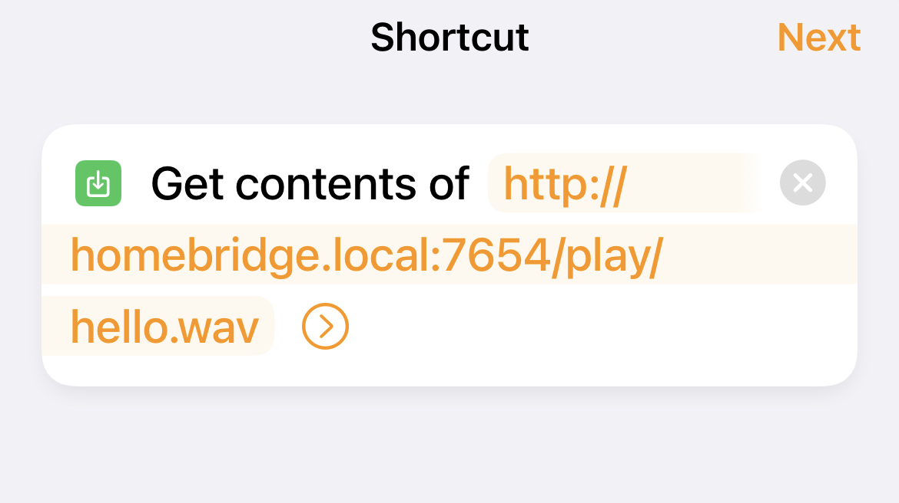
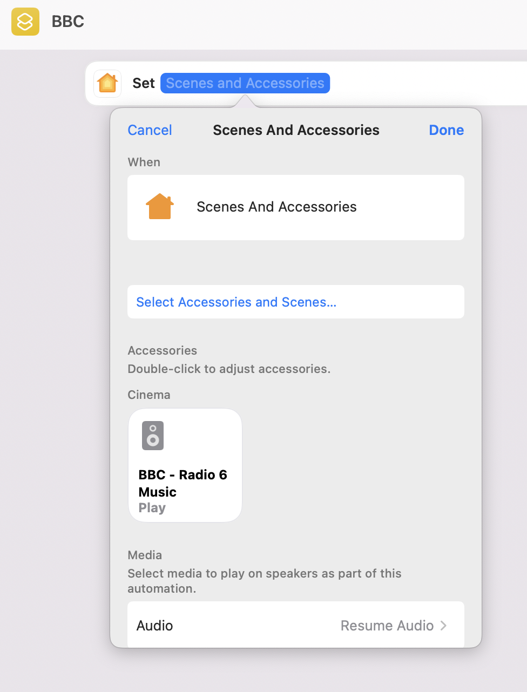

<p align="center">


</p>

# HomePod mini radio support

Homebridge accessory for streaming radio to the Homepod mini

## Streaming radio to HomePod (mini)

Main idea is to stream to the HomePod mini (or Apple TV) with the following command:
```
ffmpeg -i <streamUrl> -f mp3 - | atvremote --id <homepodId> stream_file=-
```

- automatically stops streaming when HomePod is used by another app
- sometimes audio streaming stops, so plugin automatically restarts it 

> **_Note:_**  After plugin v2.0 - streaming and retry logic moved to stream.py script

## Requirements 
- NodeJS (>=8.9.3) with NPM (>=6.4.1)
- ffmpeg
- pyatv

For the HomePod you need to specify device Mac address. 

## Usage Example:

### Multiple radio accessories support

> **_Note:_** each radio speaker must be added to home separately with homebridge pin pairing

Config example:

```
{
    "platform": "HomepodRadioPlatform",
    "serialNumber": "20020105:00",
    "homepodId": "<homepod id>",
    "httpPort": 7654,
    "mediaPath": "/media/homepod",
    "radios": [
        {
            "name": "BBC - Radio 1",
            "radioUrl": "http://stream.live.vc.bbcmedia.co.uk/bbc_radio_one",
            "artworkUrl": "https://ichef.bbci.co.uk/images/ic/1920x1080/p05d68tx.jpg",
            "autoResume": true,
            "onSwitch": true
        }
    ]
}
```

### Radio metadata support

Some radios provide metadata about currently played tracks. Plugin support optional `metadataUrl` parameter and tries to fetch JSON in format (example URL: https://o.tavrmedia.ua/rokscla):
```
[
      {
            "stime": "15:29:21",
            "time": "15:29",
            "singer": "Billy Joel",
            "song": "Honesty",
            "cover": "https://www.radioroks.ua/static/img/content/cover/0/38/500x500.jpg"
      },
      {
            "stime": "15:25:38",
            "time": "15:25",
            "singer": "Fleetwood Mac",
            "song": "Everywhere",
            "cover": ""
      },
      ...
  ]
```

Then plugin:
1. updates radio stream with fetched `singer`/`song` data
2. updates radio artwork with image downloaded using `cover`

## Play mp3/wav file from Home automation

> **_Note:_**  this feature does not add additional speaker/switch accessories (see TODO)

- Download your files to Homebridge server. For example download hello.wav 
```
$ mkdir -r /home/pi/media
$ <downlaod files to /home/pi/media>
$ ls /home/pi/media
-rw-r--r-- 1 pi   pi     94622 Jan 10 16:46 hello.wav
```
- Configure plugin to play files from /home/pi/media, set mediaPath property:
```
  "mediaPath": "/home/pi/media",
```
- Restart Homebridge
- Configure automation to play file
   - Select/Create automation in Home app
   - Tap "Select Accessories and Scenes..."
   - At the botton tap "Convert to Shortcut"
   - Create shortcut:

   - Test shortcut

> **_Note:_**  you should use homebridge server name or IP (default for Homebridge server is homebridge.local)

Example:
- Homebridge server is running on host "homebridge.local"
- hello.mp3 file is on the same server on /var/www/media
- Plugin's "httpPort" is set to 4567
- Plugin's "mediaPath" is set to /var/www/media

Then you can trigger playback of `hello.mp3` even from browser by navigating to: http://homebridge.local:4567/play/hello.mp3


## HomePod access setup

In the Home app settings:

- Tap the Homes and Home Settings button.
- Tap Home Settings > Allow Speaker & TV Access, then choose "allow everyone"
- *Important!* Reboot the HomePod

## Siri support (works on iPhone/iPad)

- Create shortcut with name (for example) "Start Radio"
- Select "Control home" action, check corresponding speaker and in "Media" section select "Resume Audio")

- Say "Hey Siri, start radio" on iPhone/iPad (on HomePod mini Siri does not run it properly)


## Dependencies

### ffmpeg lib

- install ffmpeg

```
sudo apt-get install ffmpeg
```

### PyATV lib

For streaming to the HomePod we are using pyatv (https://pyatv.dev). Setup instructions (for RaspberryPi)

- install python3  
```
sudo apt-get install python3
```
- install pip3
``` 
sudo apt-get install python3-pip
```
- install pyatv 
```
pip3 install pyatv
```
- make atvremote available for homebridge
```
sudo ln -s /home/pi/.local/bin/atvremote /usr/local/bin/atvremote
```

### Docker image with preinstalled dependencies (ubuntu)

Docker image build based on oznu/homebridge:ubuntu (with ffmpeg&Homebridge preinstalled)

Mode info: https://hub.docker.com/r/pkushchak/homebridge-pyatv/tags

## Setup steps

### Identify HomePod mini ID:
- run command:
```
atvremote scan
```
- from output select one of Identifiers:
```
       Name: HomePod
   Model/SW: HomePod Mini, tvOS 15.2
    Address: 192.168.1.7
        MAC: F4:22:F0:10:33:71
 Deep Sleep: False
Identifiers:
 - F4:22:F0:10:33:71
 - F422F0103371
```

### Stream URL format
The easieast would be to get streaming url from your favorite radio playlist (usually .m3u file)
Example For BBC Radio: https://gist.github.com/bpsib/67089b959e4fa898af69fea59ad74bc3


## Known issues

### 1. Pairing setting for the HomePod (fixed by *HomePod access setup* step):

Make sure your HomePod has ```Pairing: NotNeeded``` set for RAOP protocol. Command
```
atvremote scan
```
Should show for your device:
```
Services:
 - Protocol: Companion, Port: 49152, Credentials: None, Requires Password: False, Password: None, Pairing: Unsupported
 - Protocol: AirPlay, Port: 7000, Credentials: None, Requires Password: False, Password: None, Pairing: NotNeeded
 - Protocol: RAOP, Port: 7000, Credentials: None, Requires Password: False, Password: None, Pairing: NotNeeded
```

> **_Note:_**  streaming will not work if you get ```Pairing: Disabled``` or ```Pairing: Unsupported```

### 2. HomePod playback errors

Sometimes (quite rarely) playback fails and in the logs there are errors like:
```
  pyatv.exceptions.HttpError: RTSP/1.0 method SETUP failed with code 500: Internal Server Error
```

Typically this error dissapears after HomePod restart.

### 3. Streaming to stereo pair
Looks like this is not supported at the moment by pyatv

### 4. Speaker accessory controls
With iOS 15 Homekit does not support `volume control` and `start/stop` for speaker accessory (at least for speakers exposed by Homebridge). So I'd suggest to enable switch accessory for each radio

## TODO list
1. Switch accessory for the audio file playback (with loop support)
2. Play audio file on the HomePod with provided url
3. Radio streaming to the multiple HomePods
